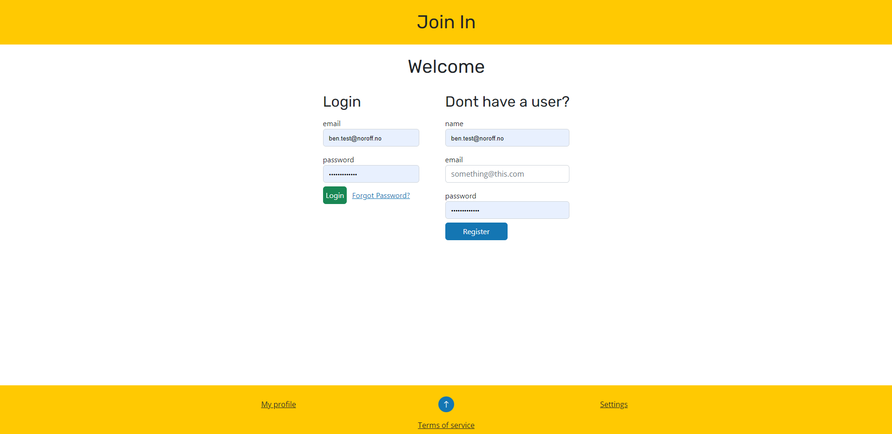

# Javascript 2 CA - JoinIn



JoinIn - An social media platform, where you can post your thoughts and images, and see what others are up to.

Backend opperated by an API.

## Status

[](https://app.netlify.com/sites/joininv2-feed/deploys)

## Table of Contents

- [Description](#description)
- [Built With](#built-with)
- [Getting Started](#getting-started)
  - [Installing](#installing)
  - [Running](#running)
- [Contributing](#contributing)
- [Contact](#contact)
- [improvements](#improvements)

## Description

This was a school project, aimed at showing what I have learned from this course. This assignment was an follow up from the one before, Here I would connect the Frontend i had designed to an API, And add other features to the site, including sort, filter and search functions.

### Here are the requirements for the assignment:

- User with @noroff.no or @stud.noroff.no email can register profile
- Registered user can login
- User can view a post content feed
- User can filter the post content feed
- User can search the post content feed
- User can view a post content item by ID
- User can create a post content item
- User can update a post content item
- User can delete a post content item

I have used localstorage to Save user data and keep track of the JWT token, making user experience better.
The website is set up to have authentication required to access the website. this means that you wont have access to anything on the api before regestering and logging in.
**Note** you can be on the other pages, but you wont be able to see any content, only placeholders.

I have tried creating functions that are reusable, for example the globalApiCall can get and send data, making it easier to access the api.
also the responses.mjs is multiple funcitions to create Bootstrap alerts, and inserting them into the DOM.

## Built With

I built the project using vanilla javascript, html and css. I also used the following libraries:

- [Bootstrap](https://getbootstrap.com)
- [sass](https://sass-lang.com/)

## Getting Started

### Installing

How to reproduce the project:

1. Clone the repo:

```bash
git clone git@github.com:puggen1/JoinInV2.git
```

2. Install the dependencies:

```
npm install
```

### Running

To run the app, run the following commands:

start both sass and live server:

```bash
npm run dev
```

or start both sass and live server in different terminals:

```bash
npm run sass
```

```bash
npm run live
```

**Note** i would recommend using the vscode extension live server, as it will more easily work with sass.

## Contributing

If you want to contribute to the project, either by fixing bugs or adding features, feel free to do so.
If you have found an bug, please create an issue, and i will try to fix it as soon as possible.
You can open a pull request if you want to add features or fix bugs yourself.

## Contact

You can contact me on the following places:

[LinkedIn](https://www.linkedin.com/in/bendik-kvam/)

## improvements

I have made the following improvements to the project:
